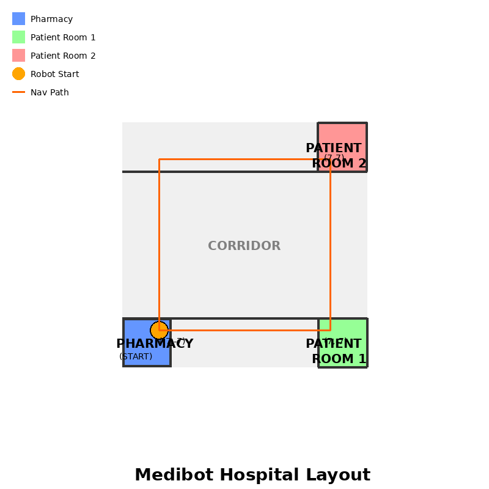

# Medibot - Hospital Automation Robot

A ROS2 Humble-based hospital automation system that enables autonomous navigation of a mobile robot in a simulated hospital environment. The robot can navigate from starting points (like a pharmacy) to destinations (like patient rooms) using SLAM, AMCL, and path planning.

## Features

- **Robot Description**: Differential drive robot with laser scanner for navigation
- **Hospital Environment**: Custom Gazebo world with pharmacy and patient rooms
- **Autonomous Navigation**: Integration with Nav2 stack for path planning and obstacle avoidance
- **SLAM Support**: SLAM Toolbox integration for mapping
- **AMCL Localization**: Adaptive Monte Carlo Localization for robot positioning

## System Requirements

- ROS2 Humble
- Gazebo (gazebo_ros_pkgs)
- Navigation2 (nav2_bringup)
- SLAM Toolbox
- Python 3.8+

## Installation

1. **Install ROS2 Humble** (if not already installed):
   Follow the official instructions at: https://docs.ros.org/en/humble/Installation.html

2. **Install dependencies**:
   ```bash
   sudo apt update
   sudo apt install ros-humble-gazebo-ros-pkgs ros-humble-navigation2 ros-humble-nav2-bringup ros-humble-slam-toolbox
   ```

3. **Clone and build the workspace**:
   ```bash
   cd ~/
   git clone https://github.com/Osita16/Medibot.git
   cd Medibot
   colcon build
   source install/setup.bash
   ```

## Package Structure

```
Medibot/
├── src/
│   ├── medibot_description/      # Robot URDF and launch files
│   │   ├── urdf/
│   │   │   └── medibot.urdf.xacro
│   │   └── launch/
│   │       └── display.launch.py
│   │
│   ├── medibot_gazebo/           # Gazebo simulation files
│   │   ├── worlds/
│   │   │   └── hospital.world
│   │   └── launch/
│   │       └── hospital_simulation.launch.py
│   │
│   └── medibot_navigation/       # Navigation configuration
│       ├── config/
│       │   └── nav2_params.yaml
│       ├── maps/
│       │   └── hospital_map.yaml
│       └── launch/
│           ├── navigation.launch.py
│           └── slam.launch.py
└── README.md
```

## Usage

### 1. Launch Hospital Simulation

Start the Gazebo simulation with the hospital environment and spawn the robot:

```bash
source install/setup.bash
ros2 launch medibot_gazebo hospital_simulation.launch.py
```

The robot will spawn in the pharmacy area (starting position at coordinates: x=-7.0, y=-7.0).

### 2. Create a Map using SLAM (First Time Setup)

To create a map of the hospital environment:

```bash
# In a new terminal
source install/setup.bash
ros2 launch medibot_navigation slam.launch.py
```

Then control the robot to explore the environment:

```bash
# In another terminal
source install/setup.bash
ros2 run teleop_twist_keyboard teleop_twist_keyboard
```

Save the map when you're done exploring:

```bash
ros2 run nav2_map_server map_saver_cli -f ~/medibot_map
```

Copy the generated map files to the maps directory:

```bash
cp ~/medibot_map.pgm ~/medibot_map.yaml src/medibot_navigation/maps/hospital_map.pgm
cp ~/medibot_map.yaml src/medibot_navigation/maps/hospital_map.yaml
```

### 3. Autonomous Navigation (After Creating a Map)

Launch navigation with the created map:

```bash
source install/setup.bash
ros2 launch medibot_navigation navigation.launch.py
```

#### Set Navigation Goals

You can set navigation goals in two ways:

**Using RViz2:**
1. Click "2D Pose Estimate" and set the initial pose
2. Click "Nav2 Goal" and set the destination

**Using Command Line:**
```bash
ros2 topic pub --once /goal_pose geometry_msgs/msg/PoseStamped "
header:
  frame_id: 'map'
pose:
  position:
    x: 7.0
    y: -7.0
    z: 0.0
  orientation:
    x: 0.0
    y: 0.0
    z: 0.0
    w: 1.0"
```

### Example Navigation Scenarios

**Pharmacy to Patient Room 1:**
- Start: Pharmacy at (-7.0, -7.0)
- Goal: Patient Room 1 at (7.0, -7.0)

**Pharmacy to Patient Room 2:**
- Start: Pharmacy at (-7.0, -7.0)
- Goal: Patient Room 2 at (7.0, 7.0)

## Hospital Environment Layout

The simulated hospital environment includes:

- **Pharmacy** (Blue): Starting area located at the left side of the hospital (-8, -8)
- **Central Corridor**: Main hallway connecting all rooms
- **Patient Room 1** (Green): Located on the right side, bottom (-8, -8)
- **Patient Room 2** (Red): Located on the right side, top (8, 8)



## Robot Specifications

- **Base**: Differential drive platform (0.6m x 0.4m x 0.2m)
- **Wheels**: Two driven wheels (0.1m radius)
- **Caster**: Front caster wheel for stability
- **Sensor**: 360-degree laser scanner (0.1m to 12m range)
- **Max Speed**: 0.26 m/s linear, 1.0 rad/s angular

## Navigation Configuration

The system uses Nav2 with the following key components:

- **Global Planner**: NavFn planner for computing optimal paths
- **Local Planner**: DWB controller for dynamic obstacle avoidance
- **Recovery Behaviors**: Spin, backup, and wait behaviors
- **Localization**: AMCL for pose estimation using laser scans

## Development and Customization

### Modifying the Robot

Edit the URDF file at `src/medibot_description/urdf/medibot.urdf.xacro` to:
- Change robot dimensions
- Add sensors
- Modify wheel parameters

### Customizing the Hospital World

Edit `src/medibot_gazebo/worlds/hospital.world` to:
- Add more rooms
- Place obstacles
- Modify room layouts

### Tuning Navigation Parameters

Adjust parameters in `src/medibot_navigation/config/nav2_params.yaml` for:
- Speed and acceleration limits
- Costmap resolution
- Planner behavior
- Recovery behaviors

## Troubleshooting

**Robot doesn't move:**
- Check that cmd_vel topic is being published: `ros2 topic echo /cmd_vel`
- Verify Gazebo plugins are loaded correctly

**Navigation fails:**
- Ensure map is loaded correctly: `ros2 topic echo /map`
- Check TF tree: `ros2 run tf2_tools view_frames`
- Verify laser scan is publishing: `ros2 topic echo /scan`

**SLAM not working:**
- Confirm laser scanner is active in Gazebo
- Check that odom is being published: `ros2 topic echo /odom`

## Future Enhancements

- [ ] Multiple floor support
- [ ] Dynamic obstacle avoidance
- [ ] Patient tracking and delivery systems
- [ ] Multi-robot coordination
- [ ] Integration with hospital management systems
- [ ] Advanced path planning with time constraints

## Contributing

Contributions are welcome! Please feel free to submit pull requests or open issues for bugs and feature requests.

## License

Apache License 2.0

## Authors

Medibot Development Team

## Acknowledgments

- ROS2 Navigation Stack (Nav2)
- SLAM Toolbox
- Gazebo Simulation Environment
